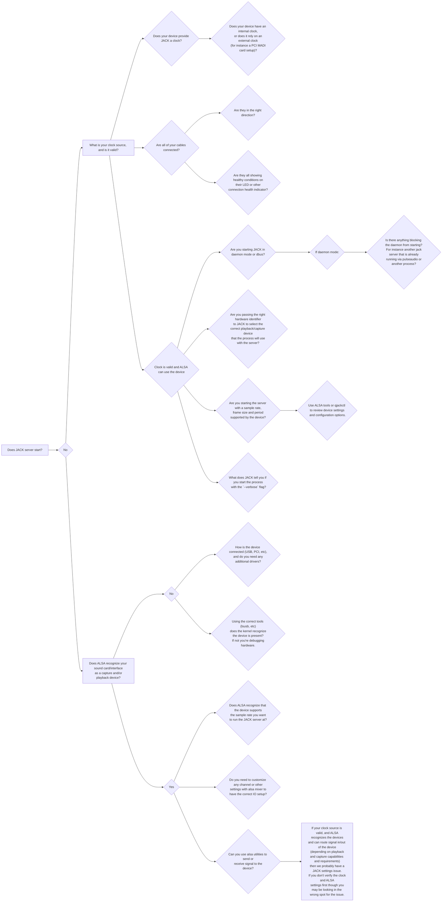

Last year I became the lead engineer on a new project. After joining the project I spent a lot of time helping users and engineers debug [JACK audio](http://jackaudio.org) behavior (although JACK typically wasn't the cause of the observed issue). While I had used Core Audio in the past I wasn't as familiar with JACK at the time, so I thought I would write down a few of the things I have learned to check first when somebody tells me they are having an issue with JACK. These are specific to running JACK on Linux, in my case Ubuntu.

That's a lot to check, and I employ various ALSA cli utilities along with JACK tools like qjackctl to help collect information as I iterate through the items above until I get to a state where the JACK server will start. Once I get the JACK server started if errors are reported it tends to fall into a couple categories (I'm sure there are more, this is just based on my experience so far):

1. JACK client issues
	1. This is a pretty broad space since really a jack client can represent just about any application/algorithm that you want to wrap as a jack client and have audio or midi in/out port support. A few things I've seen:
		1. The application runs at a fixed rate that isn't compatible with the rate the server is running at.
			1. You will either need to update the client, run the server at a different rate, or do sample rate conversion.
		2. The application parses JACK server output information and doesn't behave correctly when the server runs in verbose mode.
			1. There is probably a better way to get the information the client needs without parsing jack server output.
		3. The MIDI messages that the application receives are not parsed correctly.
			1. Use MIDI utilities to check the message format/structure and either fix the sending or receiving application code.
		4. Resource errors - these tend to be addressable with standard tools (writing tests, profiling the application, static analysis, etc).
			1. Memory errors.
			2. Callback code doesn't execute within the allotted time.
			3. Improper port management.
			4. Logic bugs.
2. Unstable clock
	1. This one is a little tricky. If the jack server starts, but loses the clock source you can check a few things.
		1. Is the device still connected correctly, and if it's external did it lose power?
		2. Check syslogs and dbus. Did the hardware disconnect and reconnect?
		3. If the device clock is external does the device have any logs that you should review?
		4. If none of the points above expose any useful information then you will probably need to do deeper monitoring, and possibly troubleshooting at the driver/device level.
			- Does the error happens on a set time interval
			- Can you replicate it on a second machine
			- What debug information is available at the driver level

Working with and building JACK applications has been a really interesting experience. Making sure everything aligns as expected from hardware through software has taught me a lot. Maybe some of this will help somebody else if they are debugging JACK workflows for the first time.